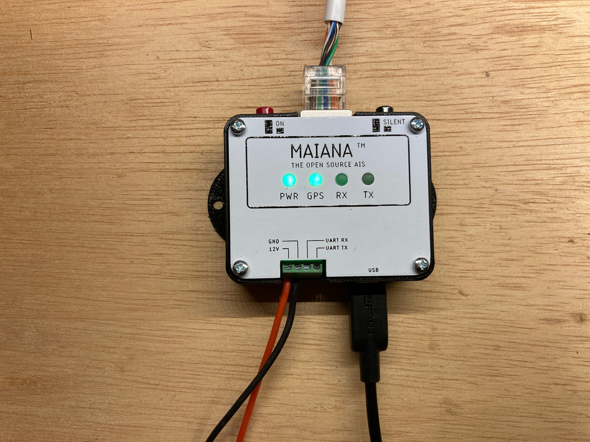
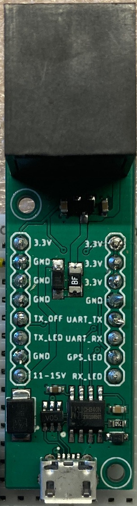

# MAIANA&trade;: The Open Source AIS Transponder

I started this project around 2015 with the intention of experimenting and eventually building something for my own boat.
I was not impressed with commercial AIS class B transponders. They seemed bloated, expensive and some of them were particularly power-hungry. Also, my boat is rather small and I have very little room for "nav" instruments, so I didn't want a huge enclosure inside plus two external RF cables, one for VHF and one for GPS. So I set out to create my own "lean and mean" design and I sailed with it for 2 years.

Fast forward to 2021, and several other sailors who are looking for the same features in an AIS unit asked me to build it for them. Here are some examples:

The main difference between MAIANA&trade; and every commercial transponder is that it's a self-contained unit, and thus its performance is 100% repeatable. The entire transponder circuit, the GNSS and all antennas are in the same housing. The design has been validated by fabricating _over 100 units_ now (February 2022).

So with all the core functionality kept outside and under tight control, the only other thing we need is power and data connections. Now, what's the most common cable that can carry a few signals 50 feet away? If you guessed "Ethernet", you guessed right. Commonplace Cat5 cable can deliver power plus serial data signals anywhere on an average sized pleasure boat. So that's how the exterior unit connects to the cabin, where one of these breakouts offers USB, NMEA0183 or NMEA2000 adapters to connect to the rest of the boat's systems. 

## Hardware Design

### Mechanical
The antenna casing that you see in these photos is a piece of 1" Schedule 40 "furniture" grade PVC pipe. It is the highest grade of such material, with a solid white PVC core (not a coated household grade pipe). Still, it's the most inexpensive UV resistant material available, and it looks great too!

The VHF antenna whip is built using an epoxy wound filament tube coated with high quality, UV resistant irradiated polyolefin ("heat shrink"). The company that makes this tubing (and helped me with this design challenge) also built the landing gear for NASA's Ingenuity helicopter on Mars, so they definitely understand how to deal with harsh environments. The bottomline is that unlike typical fiberglass antenna masts, this antenna is not going to degrade and "blossom" under continuous UV exposure. Starting with January of 2022, the antenna tube will be made of two telescopic pieces of the same material. This will greatly reduce the cost of shipping the kit to Europe and Australia.

The entire outdoor assembly is held together by the same high grade heat shrink tubing, so there is no need for any adhesives! The main water seal is formed by heat shrinking around a specially designed 3D printed cap made of PLA. This part naturally softens when heated and as it's compressed by the heat shrink tubing surrounding it, it forms a permanent, watertight colar around the antenna tube. This blocks rain water and salt spray from the top. A layer of clear heat shrink in the interior forms a secondary water seal encompassing the lower part of the antenna. Finally, the PCB can be sprayed with conformal coating for an added layer of protection. Silicone spray works best and has no appreciable detuning effect on the GNSS.

With no adhesives getting in the way, the unit can actually be opened and serviced by (carefully) cutting through the heat shrink tubing with a knife, then resealing with the same material and method as before. This, in fact, was one of my design goals from the beginning.

### Electrical
As I mentioned already, the transponder circuit is inside the antenna case. It's a 24mm x 84mm 4-layer PCB:

The core design is based on two Silicon Labs "EZRadio Pro" series ICs. All kits shipping today are based on the Si4467 as this is the only part I have been able to source from spot markets in China.

The microcontroller on this board is a STM32L4 series (422, 431 and 432 supported). I chose these because the 80MHz clock allows the SPI bus to operate at exactly 10MHz which is the maximum supported by the Silabs RF ICs. This is important, as a transponder is a *hard real time* application so SPI latency must be minimized. All kits today are based on the STM32L432KBU6 as (again) it's the only part that I have been able to source from China.

The GNSS is now a Quectel L76L-M33 and relies on a Johansson ceramic chip antenna. It usually takes a minute to acquire a fix outdoors from a cold start. With the latest antenna tuning, it offers near-navigation grade accuracy (typical HDOP at sea < 1 meter).

The transmitter front end is based on a power MOSFET typically found in handheld VHF radios and outputs just over 2 Watts (+33dBm). It has a verified range of over 20 nautical miles on a masthead and 10+ miles on a pushpit.

The system is designed to run from a 12V battery and exposes a 3.3V-level UART for connecting to the rest of the boat. The UART continuously sends GPS and AIS data in NMEA0183 format at 38.4Kbps. It also accepts certain commands for management. The breakout boxes pictured above deliver this stream via USB, NME0183 (RS422) or NMEA 2000 (CAN). The 3 "fancy" breakouts feature _galvanic isolation_ of their USB connection to avoid causing unintended problems with laptops and other devices whose power supplies are meant to _float_. This also means that you cannot use USB to power MAIANA&trade; - it must connect to a 12V battery.

In addition, there is now a "bare bones" UART+USB breakout:

This provides the simplest, lowest cost interface to a Raspberry Pi, Arduino or any other similar system you may want to wire directly. It is _not_ galvanically isolated to keep the cost really low. This adapter is now part of the base kit and ships with every configuration.

For the circuit to transmit, it must be configured with persistent station data (MMSI, call sign, name, dimensions, etc). This is stored in an EEPROM and is provisioned over a USB/serial connection via a command line interface. If station data is not provisioned, the device will simply run as a 2 channel AIS + GNSS receiver.

SOTDMA synchronization is based on the very acurate 1 PPS signal from the GNSS and the UTC clock. MAIANA&trade; does not synchronize itself to other stations because practical experience revealed that it's literally the "Wild West" out there: There are *many* commercial class A systems in operation today with buggy time slot management, so the simplest solution is to not rely on any of them. That said, the design behaves as a "class B" so it will not attempt to reserve time slots. It will just transmit autonomously and independently, based on Clear Channel Assessment, at the schedule permitted for this class of device. 

All adapters (except the "bare bones" one) feature a *silent mode* switch to explicitly disable transmission. If you need this for the UART adapter, you can wire one yourself.

In terms of power consumption, the main board draws about 35mA from 12V in receive mode, and spikes up to 650mA during transmission (for only 27 milliseconds). The adapters add an extra 0.5mA - 25mA depending on choice. So MAIANA&trade;'s most power hungry configuration needs about 0.8 Watts, which is a lot less than a typical LED-based cabin light.

### Software

The transponder firmware is an [Eclipse CDT project](latest/Firmware/Transponder) that you could clone and build. The code is C++ with a BSP abstraction layer so you need to tweak bsp/bsp.hpp or define one of the required symbols in the preprocessor to build for different board revisions. It contains snippets of STM32Cube generated code, but is does not follow ST's "spaghetti" structure.

The NMEA2000 adapter also has its own separate [firmware project](latest/Firmware/NMEA2000Adapter).

As of December 2021, MAIANA&trade; is fully integrated into [OpenPlotter](https://openmarine.net/openplotter). This means that it can be provisioned and managed entirely from its graphical interface, including firmware updates. To accomplish this, I had to make both a hardware and a software change: 

- The hardware change was to reinstate the I2C EEPROM that I used in earlier designs. This was necessary because STM32 applications that are interrupt heavy cannot safely erase and write any pages in the same flash bank, as the *entire* bank gets locked. This means that the next interrupt may be unable to execute, thus causing the processor to hang until the watchdog resets it. Moving persistence to an EEPROM solves this problem.

- The software change was to dust off the original [bootloader](latest/Firmware/Bootloader) that I wrote years ago and make it bulletproof: Even if you manage to brick the unit by uploading garbage firmware into it, it has a built-in "rescue" mode. All you have to do is toggle the TX switch a couple of times during the first 2 seconds after power-up and it will enter firmware update mode again.

### CAD

Everything is [here](latest/CAD). 

### Building the unit

This is going to be difficult for all but the most technically advanced. The board features all surface mounted components, with 4 QFNs, a few SOT-363s and tightly spaced 0603 passives. The antenna switch on board 11.3.0 is about 0.8 x 1 mm and you'll need a microscope to align it. So unless you're very skilled and well equipped, you will find it difficult to build. 

### Buying a kit

I have developed a kit which includes pre-soldered (and programmed) boards as well as the antenna, main casing and heat shrink tubing. See [the installation manual here](https://github.com/peterantypas/maiana/blob/master/latest/Manuals/MAIANA%E2%84%A2%20Assembly%20Manual%20(Rev%204).pdf) to get a better idea of the process.

If you are located in North America, send an email to *maiana.kits@_dontspam_gmail.com* (remove the spambot blocker of course). 

If you're located anywhere else, you can order a kit from the [OpenMarine store](https://shop.openmarine.net) which ships from Barcelona, Spain.

### License

CAD and transponder firmware are licensed under GPLV3. I chose the most "copyleft" license to discourage commercial entities from ripping this off and then "close-sourcing" it. The flipside of this is that if you can fork the design and make something better, then you deserve the success! That said, MAIANA&trade; will become a registered trademark soon, so if you plan to do this you must use a different name.

The NMEA2000 adapter firmware is under MIT license to be consistent with the libraries it depends on. Feel free to use it as you wish. 

