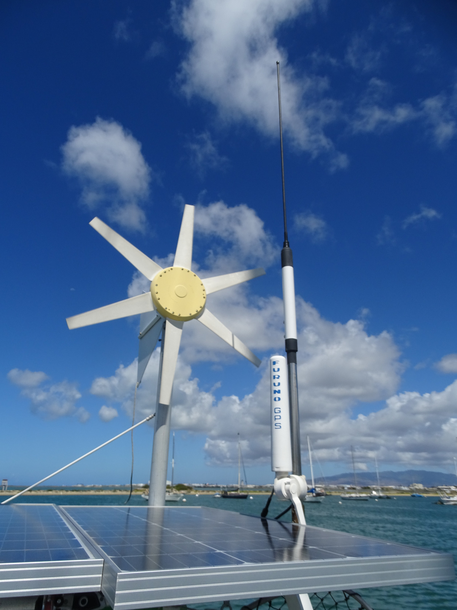
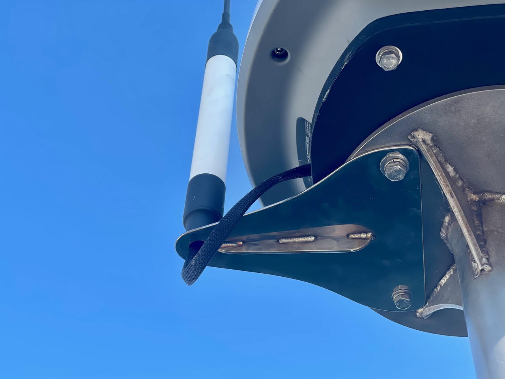
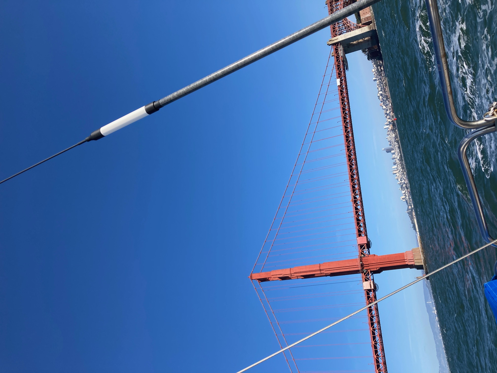
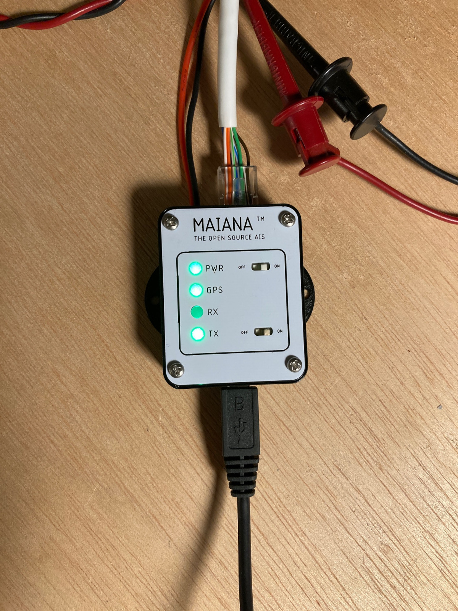
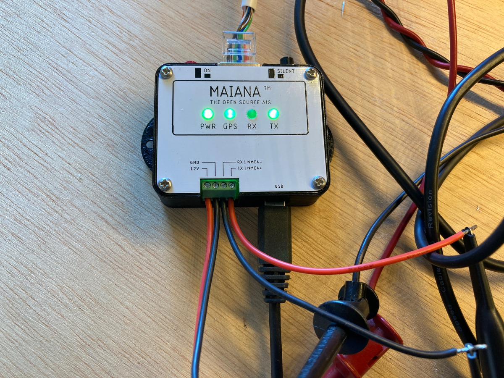
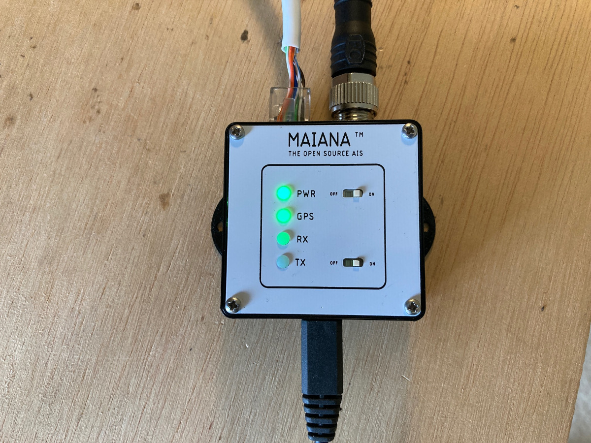

# MAIANA&trade;: The Open Source AIS Transponder

I started this project around 2015 with the intention of experimenting and eventually building something for my own boat.
I was not impressed with commercial AIS class B transponders. They seemed bloated, expensive and some of them
were particularly power-hungry. Also, they required at least two external RF cables, one for VHF and one for GPS. So I set out to create a lean and mean design. I must say that I'm quite pleased with the results. Here are some examples of MAIANA&trade; installations:

The main difference between MAIANA&trade; and every commercial transponder is that it's a self-contained unit, and thus its performance is 100% repeatable. With this design, we don't have to worry about a worn out coax going to the masthead via an antenna switch of unknown attenuation, connected to a whip antenna of unknown pedigree. The MAIANA&trade; *system* delivers a consistent performance, with an SWR of 1.24:1 or better:

e cabin. This requires an RJ45 (Ethernet) cable which runs from the outside unit to one of these breakout boxes down below:

## Hardware Design

### Mechanical
The antenna casing that you see in these photos is a piece of 1" Schedule 40 "furniture" grade PVC pipe. It is simply the most inexpensive UV resistant material available, and it looks great top!

The VHF antenna whip is built using an epoxy would filament tube coated with high grade US-made irradiated polyolefin ("heat shrink") tubing. The company that makes this tubing (and helped me with this design challenge) also built the landing gear for NASA's Ingenuity helicopter, currently flying on Mars. They definitely understand how to deal with harsh environments. The bottomline is that unlike typical fiberglass antenna masts you might see around (or have on your boat already), this antenna is not going to degrade and "blossom" under continuous sun exposure.

The entire outdoor assembly is held together by the same high grade heat shrink tubing. The main water seal is formed by heat shrinking the tube around a specially designed 3D printed cap made of PLA. This part naturally softens when heated, and because it is compressed by the heat shrink tubing, it forms a permanent, tight colar around the antenna tube. A layer of clear heat shrink in the interior forms a secondary water seal encompassing the lower part of the antenna and the PCB.

The unit can be opened and serviced by (carefully) cutting through the heat shrink tubing with a knife, then resealing with the same material and method as before.

### Electrical
The transponder circuit is inside the antenna case. It's a 24mm x 84mm 4-layer PCB:

The core design is based on two Silicon Labs "EZRadio Pro" series ICs. The first IC is a transceiver and the second one is a full-time receiver. Currently, due to the global chip shortage, these ICs are impossible to source. I have secured a small quantity because I placed a direct order with their main US distributor last year, when their lead time was about 16 weeks. It is now 40+ weeks.

The microcontroller on this board is a STM32L4 series (412, 422, 431 and 432 supported). I chose these because the 80MHz clock allows the SPI bus to operate at exactly 10MHz which is the maximum supported by the Silabs RF ICs. This is crucial, as a transponder is a hard real-time application that relies on interrupts for precise timing of the transmit function, so SPI latency must be minimized.

The GNSS is a Quectel L76 module and relies on a Johansson ceramic chip antenna. It usually takes a minute to acquire a fix outdoors from a cold start.
The transmitter output is 2 Watts (+33dBm) and it has a verified range of over 10 nautical miles.

The unit runs on 12V and exposes a 3.3V UART for connecting to the rest of the boat's system. The UART continuously sends GPS and AIS data in NMEA0183 format at 38.4Kbps. The breakout boxes pictured above deliver this stream via USB, NME0183 (RS422) or NMEA 2000 (CAN). All 3 breakouts feature **galvanic isolation** of their USB connection to avoid causing unintended problems with laptops and other devices whose power supplies are meant to "float".

Of course, there are many different solutions available and every boater has different preferences. This interface box is a separate project and it will eventually support NMEA0183 (RS422) as well as NMEA2000 interfaces.

For the circuit to transmit, it must be configured with persistent station data (MMSI, call sign, name, dimensions, etc). This is stored in MCU flash and is provisioned via a command line interface. If station data is not provisioned, the device will simply run as a receiver.

The unit implements SOTDMA synchronization based on the very acurate 1 PPS signal from the GPS and the UTC clock, but being a class B, it will not attempt to reserve time slots. It will just transmit autonomously and independently, based on Clear Channel Assessment, at the schedule permitted for class B devices. 

The system draws about 30mA from 12V in RX mode, and spikes up to 600mA during transmission (for about 30 milliseconds).

The latest design (9.3 pictured above) relies on plain Cat5 cable for power, data, as well as control signals such as "TX OFF" and status LED drivers (RX/TX/GPS). 

### Software

The firmware is an Eclipse CDT project that you should be able to import and build. The code is C++ with a BSP abstraction layer so you need to tweak bsp/bsp.hpp or define one of
the required symbols in the preprocessor to build for different board revisions. It contains snippets of STM32Cube generated code, but is does not follow ST's spaghetti structure.

### Building the unit

This is going to be difficult for all but the most technically advanced. The board features all surface mounted components, with 4 QFNs, a few SOT-363s and tightly spaced 0603 passives. Unless you're skilled with stencils and reflow, you will find it challenging. 

For this reason, I'm working on a kit and I expect the first 10 or so to be available by end of June / beginning July of this year. This has been a struggle, given the state of the supply chain, so I had to make many last-minute design changes and secure enough BOM. If you're interested in the kit, sign up for my mailing list here: https://eepurl.com/hxHP-5

### License

CAD and firmware are licensed under GPLV3. I chose the most "copyleft" license possible to discourage commercial entities from ripping this off and then "close-sourcing" it. 
So don't try anything fishy, because I *will* find out and then ... well, let's just say you'll be buying me another boat and I have a particular one in mind ;)

If you're a tinkerer and want to further this design while adhering to the GPL, more power to you! Build it, sell it, give it away, do whatever you want to get it out there. 
You cannot, however, use the MAIANA&trade; name in a forked design, as it will be trademarked. Just call it something else.

