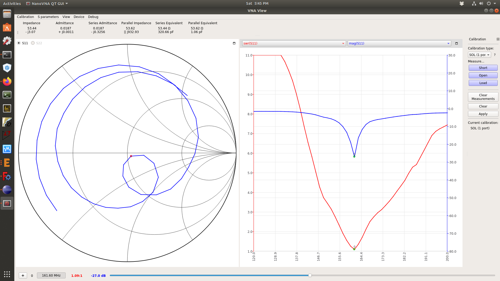
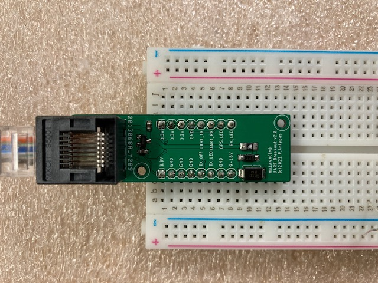

# MAIANA&trade;: The Open Source AIS Transponder

I started this project around 2015 with the intention of experimenting and eventually building something for my own boat.
I was not impressed with commercial AIS class B transponders. They seemed bloated, expensive and some of them
were particularly power-hungry. Also, they required at least two external RF cables, one for VHF and one for GPS. So I set out to create a lean and mean design. I must say that I'm quite pleased with the results. Here are some examples of MAIANA&trade; installations:

The main difference between MAIANA&trade; and every commercial transponder is that it's a self-contained unit, and thus its performance is 100% repeatable. With this design, we don't have to worry about a worn out coax going to the masthead via an antenna switch of unknown attenuation, connected to a whip antenna of unknown pedigree. MAIANA&trade; as a *system* is tuned for nothing but AIS and thus delivers a consistent RF performance, with an SWR of 1.2:1 or better:

So with all the RF kept outside and under tight control, the system only needs power and data connections. What's the most common cable that can carry a few signals 30-50 feet away? If you guessed "Ethernet", you guessed right. Commonplace Cat5 cable delivers a serial signal with minimal distortion at least 50 feet away. So that's what connects the outside unit to the cabin, where one of these 3 breakouts offers USB, NMEA0183 or NMEA2000 adapters to connect to the rest of the boat's systems:

## Hardware Design

### Mechanical
The antenna casing that you see in these photos is a piece of 1" Schedule 40 "furniture" grade PVC pipe. It is simply the most inexpensive UV resistant material available, and it looks great too!

The VHF antenna whip is built using an epoxy wound filament tube coated with high grade US-made irradiated polyolefin ("heat shrink") tubing. The company that makes this tubing (and helped me with this design challenge) also built the landing gear for NASA's Ingenuity helicopter on Mars - they definitely understand how to deal with harsh environments. The bottomline is that unlike typical fiberglass antenna masts you might see around (or have on your boat already), this antenna is not going to degrade and "blossom" under continuous sun exposure.

The entire outdoor assembly is held together by the same high grade heat shrink tubing - there are no messy adhesives to deal with. The main water seal is formed by heat shrinking the tube around a specially designed 3D printed cap made of PLA. This part naturally softens when heated, and because it is compressed by the heat shrink tubing, it forms a permanent, watertight colar around the antenna tube. A layer of clear heat shrink in the interior forms a secondary water seal encompassing the lower part of the antenna. PCBs can be coated with either silicon or acrylic conformal coating for an added layer of protection.

The unit can be opened and serviced by (carefully) cutting through the heat shrink tubing with a knife, then resealing with the same material and method as before.

### Electrical
The transponder circuit is inside the antenna case. It's a 24mm x 84mm 4-layer PCB:

The core design is based on two Silicon Labs "EZRadio Pro" series ICs. The first IC is a transceiver and the second one is a full-time receiver. Currently, due to the global chip shortage, these ICs are impossible to source. I have secured a small quantity because I placed a direct order with their main US distributor last year, when their lead time was about 16 weeks. It is now 40+ weeks.

The microcontroller on this board is a STM32L4 series (412, 422, 431 and 432 supported). I chose these because the 80MHz clock allows the SPI bus to operate at exactly 10MHz which is the maximum supported by the Silabs RF ICs. This is crucial, as a transponder is a *hard real time* application so SPI latency must be minimized.

The GNSS is now a Quectel L76L-M33 and relies on a Johansson ceramic chip antenna. It usually takes a minute to acquire a fix outdoors from a cold start. With the latest design, it offers near-navigation grade accuracy (typical HDOP < 1 meter).

The transmitter is based on a power MOSFET found in handheld VHF radios and outputs just over 2 Watts (+33dBm). It has a verified range of 10 nautical miles.

The unit runs on 12V and exposes a 3.3V UART for connecting to the rest of the boat's system. The UART continuously sends GPS and AIS data in NMEA0183 format at 38.4Kbps. The breakout boxes pictured above deliver this stream via USB, NME0183 (RS422) or NMEA 2000 (CAN). All 3 breakouts feature **galvanic isolation** of their USB connection to avoid causing unintended problems with laptops and other devices whose power supplies are meant to "float".

In addition, there is now a "bare bones" UART breakout:

This provides the simplest, lowest cost interface to a Raspberry Pi (assuming the UART is available).

For the circuit to transmit, it must be configured with persistent station data (MMSI, call sign, name, dimensions, etc). This is stored in an EEPROM and is provisioned over a USB/serial connection via a command line interface. If station data is not provisioned, the device will simply run as a 2 channel AIS + GNSS receiver (which is still useful).

In terms of power consumption, the main board draws about 32mA from 12V in RX mode, and spikes up to ~650mA during transmission (for 27 milliseconds). The adapters add an extra 2mA - 25mA depending on choice. So MAIANA&trade;'s most power hungry configuration needs 0.7 Watts, which is a lot less than the typical LED cabin light!

The unit implements SOTDMA synchronization based on the very acurate 1 PPS signal from the GNSS and the UTC clock. It does not synchronize itself to other stations because practical experience has shown that it's literally the "wild west" out there: There are many commercial class A systems in operation today with really crappy time slot management, so it's best not to rely on any of them. MAIANA&trade; behaves as a class B though, so it will not attempt to reserve time slots. It will just transmit autonomously and independently, based on Clear Channel Assessment, at the schedule permitted for class B devices. 

### Software

The transponder firmware is an [Eclipse CDT project](latest/Firmware/Transponder) that you could clone and build. The code is C++ with a BSP abstraction layer so you need to tweak bsp/bsp.hpp or define one of the required symbols in the preprocessor to build for different board revisions. It contains snippets of STM32Cube generated code, but is does not follow ST's spaghetti structure.

The NMEA2000 adapter also has its own separate [firmware project](latest/Firmware/NMEA2000Adapter).

### CAD

Everything is [here](latest/CAD). 

### Building the unit

This is going to be difficult for all but the most technically advanced. The board features all surface mounted components, with 4 QFNs, a few SOT-363s and tightly spaced 0603 passives. The antenna switch is about 0.8 x 1 mm and you'll need a microscope to align it. So unless you're very skilled and well equipped, you will find it difficult to build. 

For this reason, I have developed a kit which includes pre-soldered (and programmed) boards. Take a look [at the installation instructions here](latest/Manuals) to get a better understanding of what's involved. There is a limited number of these that I can produce (mainly due to the chip shortage), so if you're insterested, send an email to *maiana.kits@_dontspam_gmail.com* (remove the spambot blocker of course). 

### License

CAD and transponder firmware are licensed under GPLV3. I chose the most "copyleft" license possible to discourage commercial entities from ripping this off and then "close-sourcing" it. 

The NMEA2000 adapter is under MIT license to be consistent with the libraries it depends on.

MAIANA&trade; will become a registered trademark soon, so if you plan to fork the design while adhering to the GPL then simply use a different name.

